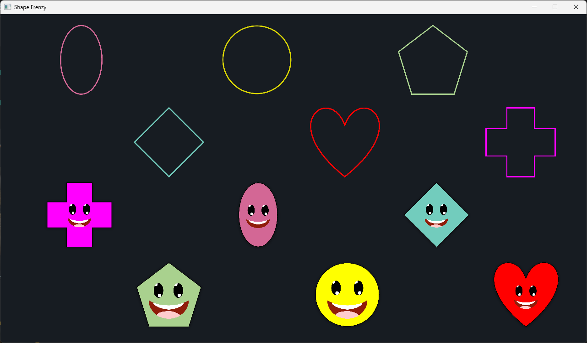

## **ShapeFrenzy**

### 📝 Overview

**ShapeFrenzy** is a JavaFX educational game developed for a client, designed to help young children improve their shape recognition skills. The gameplay is simple and intuitive — players match the falling or presented shapes to the correct holes, encouraging visual learning and coordination in a fun, colorful environment.

### 📷 Screenshots

### 🎯 Features

* **Child-Friendly Design** – Bright colors, large shapes, and simple controls for young users.
* **Shape Matching Gameplay** – Match the shape to the correct hole to score points.
* **Positive Feedback** – Encouraging sounds and animations to reward correct matches.
* **Lightweight JavaFX Application** – Runs smoothly on most systems.

### 🧰 Tech Stack

* **JavaFX** – UI and game rendering
* **Java** – Game logic and core mechanics

### 👤 Author

* GitHub: [@AceBurgundy](https://github.com/AceBurgundy)
